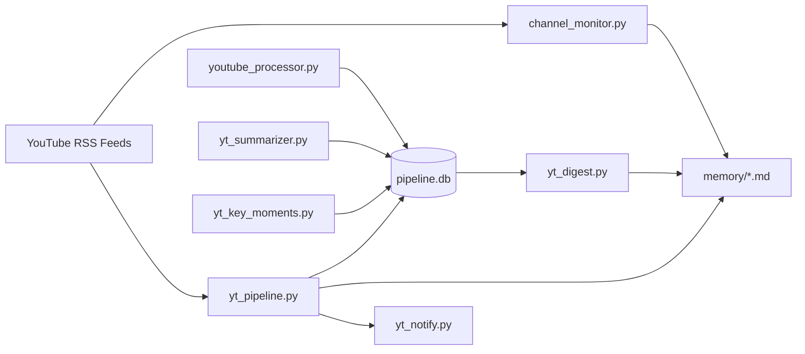

# YouTube Tools

Production-focused CLI toolkit for YouTube monitoring and intelligence workflows.

## Overview

This directory contains composable commands for:

- RSS channel monitoring
- transcript retrieval
- extractive summarization
- key moment extraction
- chat notifications
- end-to-end pipeline runs
- digest generation for briefing workflows

## Architecture



## Requirements

- Python 3.10+
- `pip`
- internet access for RSS/transcript endpoints

Install:

```bash
pip install -r YouTube/requirements.txt
```

Dev setup (tests/lint):

```bash
pip install -e .[dev]
```

## Shared modules

- `channels.py`: single source of truth for monitored channels
- `common.py`: UTC time helpers, published-date parsing, robust YouTube ID extraction

## Reliability defaults

- network timeout: `15s`
- retry policy: `3 attempts` with exponential backoff
- applies to RSS fetches, transcript fetches, and webhook deliveries

## Command reference

### 1) Channel monitor

```bash
python YouTube/channel_monitor.py --hours 24 --output yt-monitor.md
```

Options:
- `--hours/-H`: lookback window
- `--output/-o`: markdown output file in `memory/`
- `--list/-l`: print configured channels
- `--verbose`: debug logging
- `--quiet`: errors only

Output:
- JSON to stdout (automation friendly)
- progress/errors to stderr

### 2) Transcript processor

```bash
python YouTube/youtube_processor.py https://youtu.be/dQw4w9WgXcQ --json
```

Options:
- positional `video_id`: ID or URL
- `--json`: emit JSON payload

### 3) Summarizer

```bash
python YouTube/yt_summarizer.py dQw4w9WgXcQ --length 600 --format markdown
```

Options:
- positional `video_id`: ID or URL
- `--format/-f`: `text|json|markdown`
- `--length/-l`: summary character cap (enforced)

### 4) Key moments

```bash
python YouTube/yt_key_moments.py dQw4w9WgXcQ --count 8 --format markdown
```

Options:
- positional `video_id`: ID or URL
- `--count/-c`: number of moments
- `--format/-f`: `text|json|markdown`

### 5) Notifications

```bash
python YouTube/yt_notify.py --channel discord --test
```

Supported channels:
- `discord`
- `slack`
- `telegram`

Config:
- CLI flags or env vars from `YouTube/.env.example`

### 6) Pipeline

```bash
python YouTube/yt_pipeline.py --hours 24 --output youtube-pipeline.md
```

Options:
- `--hours/-H`: lookback window
- `--output/-o`: markdown output file
- `--list-channels/-l`: print channel IDs
- `--dry-run`: detect only, skip transcript/summary
- `--verbose`: debug logging
- `--quiet`: errors only

### 7) Digest

```bash
python YouTube/yt_digest.py --days 1 --transcripts --output youtube-digest.md
```

Options:
- `--days/-d`: lookback window
- `--output/-o`: markdown output file
- `--quick/-q`: compact channel counts
- `--transcripts/-t`: include transcript previews
- `--list-channels/-l`: print channel IDs
- `--no-save`: stdout only
- `--verbose`: debug logging
- `--quiet`: errors only

## Data files

- `processed_videos.db`: monitor state
- `pipeline.db`: transcript + summary state
- `memory/*.md`: generated artifacts

## Automation examples

Cron example:

```bash
0 */6 * * * cd /path/to/scripts && python YouTube/yt_pipeline.py --hours 6 --output yt-pipeline.md
15 8 * * * cd /path/to/scripts && python YouTube/yt_digest.py --days 1 --output yt-digest.md
```

GitHub Actions: see `.github/workflows/ci.yml`.

## Quality gates

- `ruff check YouTube`
- `pytest`

## Troubleshooting

- `No transcript available`: video likely has no transcript or transcript is restricted.
- empty result sets: verify `--hours/--days` window and network reachability.
- notification failures: validate webhook/token env vars and channel permissions.

## Security and operations notes

- never commit real webhook URLs or bot tokens
- rotate chat webhook credentials periodically
- keep `*.db` and `memory/` artifacts out of source control (already ignored)
